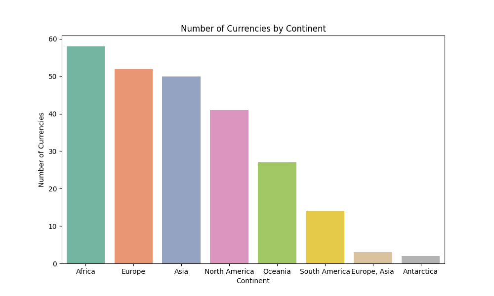
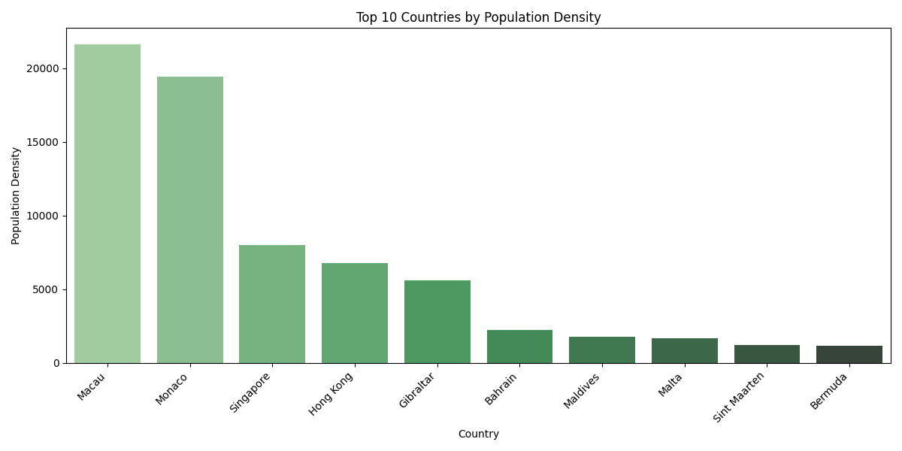
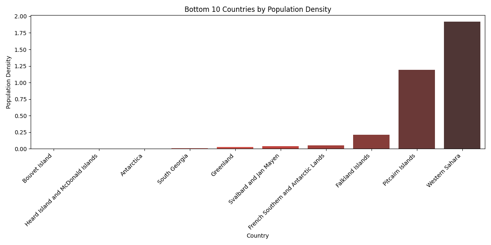
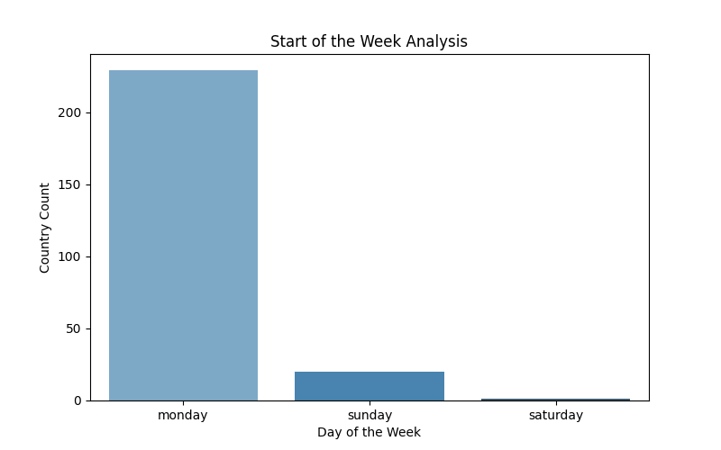
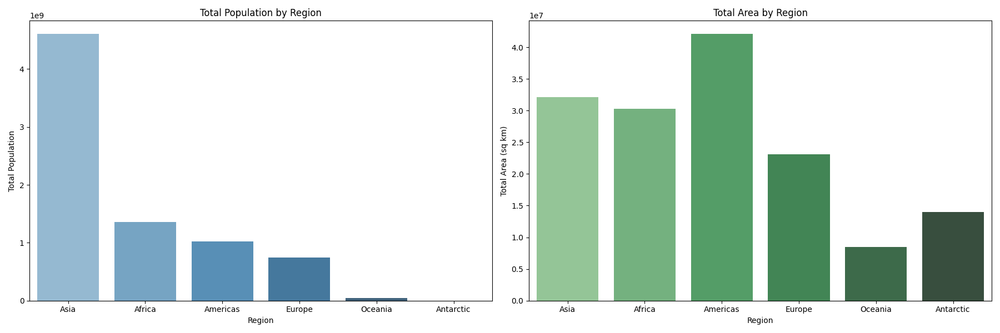

# capstone-project

# CDE-CAPSTONE: Travel Agency Data Platform

## Project Overview
This project delivers a robust *Data Platform* for a Travel Agency, enabling them to process data from the [Country REST API](https://restcountries.com/) and store it in a *cloud-based Data Lake* and *Database*. The platform facilitates predictive analytics by the agency's Data Science team, focusing on specific country attributes.

---

## Key Features
- *Data Pipeline Automation: Automates raw data extraction, transformation, and loading using **Apache Airflow*.
- *Cloud Storage in Parquet Format: Ensures efficient and scalable storage of raw data in **AWS S3*.
- *Transformations for Analytics: Extracts key attributes and loads them into an **RDS PostgreSQL database*.
- *CI/CD Integration: Uses **GitHub Actions* for linting, Docker image building, and deployment to an *EC2 instance*.
- *Infrastructure-as-Code: All AWS resources (S3, RDS, IAM, EC2) are provisioned with **Terraform, with state files managed in an **S3 backend*.
- *Data Modeling: Utilizes **DBT* to create Fact and Dimension tables for optimized querying and analytics.

---

## Workflow Description

### Data Pipeline Steps

1. *Raw Data Extraction*:
   - Extracted the entire dataset from the [Country REST API](https://restcountries.com/).
   - Stored raw data as *Parquet files* in an *AWS S3 bucket* to serve as the raw data layer.

2. *Transformation and Selection*:
   - Extracted specific fields needed for analytics, including:
     - *Country name*
     - *Independence*
     - *UN Membership*
     - *Start of the Week*
     - *Official Country Name*
     - *Common Native Name*
     - *Currency Details* (Code, Name, Symbol)
     - *Country Code* (concatenated idd.root and idd.suffix)
     - *Capital, Region, Sub-Region*
     - *Languages, Area, Population, Continents*

3. *Database Loading*:
   - Loaded the transformed data into an *RDS PostgreSQL database* to support downstream predictive analytics.

4. *Data Orchestration with Apache Airflow*:
   - Designed and deployed Airflow *DAGs* for end-to-end orchestration, including:
     - *Extraction*: Scheduled tasks to extract raw data from the API.
     - *Storage: Automated upload of raw data to **AWS S3*.
     - *Transformation and Loading: Processed the raw data into selected fields and loaded it into **RDS*.

5. *Data Modeling with DBT*:
   - Organized the transformed data into *Fact* and *Dimension* tables to enhance query performance and enable efficient analytics.

6. *CI/CD Workflow*:
   - Integrated *GitHub Actions* for automated linting, building Docker images, and pushing them to *AWS ECR*.
   - Deployed Docker containers on an *AWS EC2 instance* for execution.

---

## Terraform Configuration and State Management

- *Infrastructure Provisioning*:
  - Used *Terraform* to provision AWS resources, including:
    - **S3** bucket for the Data Lake and state file storage.
    - **RDS PostgreSQL** instance for the database.
    - **IAM roles** and **policies** for secure access.
    - **EC2 instance** for hosting Docker containers.
  - Configured the Terraform state file to be stored in an *S3 bucket*, ensuring secure and consistent state management.

---

## Docker Hosting on EC2

- Hosted Docker containers on an *AWS EC2 instance* to run the API extraction and transformation logic.
- Steps included:
  - Provisioning the EC2 instance.
  - Installing Docker and dependencies.
  - Deploying the container to execute the data pipeline.

---

## CI/CD Pipeline

- *Continuous Integration (CI)*:
  - Automated linting checks to ensure code adheres to best practices.
- *Continuous Deployment (CD)*:
  - Built and pushed Docker images to *AWS ECR*.
  - Automated deployment of updated Docker containers to the *EC2 instance*.

---

## Setup Instructions

### Prerequisites

1. AWS Account with permissions for:
   - *S3, **RDS, **ECR, **EC2, **IAM*
2. Installed Tools:
   - Terraform
   - Docker
   - DBT

---

### Deployment Steps

1. Provision the infrastructure using *Terraform*.
2. Build and push Docker images to *AWS ECR*.
3. Deploy Docker containers on *AWS EC2*.
4. Configure and execute Apache Airflow DAGs for data pipeline orchestration.
5. Run DBT transformations to create Fact and Dimension tables.

### Analysis Summary

Insights from Views:

## Currency Distribution:
Africa has the highest number of currencies (58), followed by Europe (52).

## Population Density:
Bouvet Island and Heard Island have the lowest population densities, while highly populated regions like Asia dominate the global population share.

## Start of the Week:
Most countries start their week on Monday (229 countries), while only a few start on Sunday or Saturday.

## Top Regions:
Asia has the largest population, while the Americas cover the most area.

## Top Languages:
English is the dominant language in the Americas, and French leads in Africa.

## Visualizations  

### 1. Currencies by Continent  
Bar plot showing the number of currencies per continent:  
  

---

### 2. Top 10 and Bottom 10 Countries by Population Density  

#### Top 10 Countries by Population Density  
  

#### Bottom 10 Countries by Population Density  
  

---

### 3. Start of the Week Analysis  
Bar plot showing country counts for each start day:  
  

---

### 4. Region Insights  

#### Population by Region  

### 5. Top Languages by Region  
Language distribution across regions:  
  
